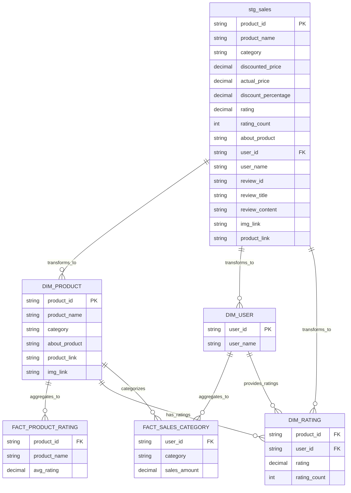

# Data Warehouse ER Diagram

## Medallion Architecture Layers

### 🥈 Silver Layer (Light Blue)
**Purpose**: Cleaned and validated data ready for business consumption
- **stg_sales**: Standardized sales dataset with data quality improvements
  - Contains 17 attributes including product details, pricing, ratings, and user information
  - Data has been cleansed, deduplicated, and standardized from bronze layer
  - Serves as the reliable source for all downstream gold layer transformations

### 🥇 Gold Layer (Light Purple)  
**Purpose**: Business-ready analytical data including both dimensions and facts

**Dimension Tables** - Master data providing context and descriptive attributes:
- **DIM_PRODUCT**: Product master data with unique product information
  - Primary key: product_id
  - Contains curated product catalog information and metadata
- **DIM_USER**: User master data with user identifiers and names
  - Primary key: user_id  
  - Contains validated customer/user profile information
- **DIM_RATING**: Bridge/junction table containing rating information
  - Links products and users through rating transactions
  - Contains both foreign keys: product_id and user_id

**Fact Tables** - Aggregated business metrics and measurable data for analytics:
- **FACT_PRODUCT_RATING**: Product performance metrics focused on ratings
  - Contains aggregated rating data (avg_rating) per product
  - Supports product quality analysis and reporting
- **FACT_SALES_CATEGORY**: Sales performance metrics by category
  - Contains sales amount aggregations by user and product category
  - Supports revenue analysis and customer segmentation

## Data Flow & Relationships
1. **ELT Process**: stg_sales (Silver) feeds data into all Gold layer tables
2. **Star Schema**: Gold dimension tables provide reference data for fact table aggregations
3. **Bridge Pattern**: DIM_RATING acts as a bridge table between DIM_PRODUCT and DIM_USER
4. **Business Intelligence**: All Gold layer tables support analytical queries and reporting

## Visual Legend
- **Light Blue Tables**: Silver layer (cleaned and validated data)
- **Light Purple Tables**: Gold layer (business-ready analytical data - dimensions & facts)
- **Relationship Lines**: Data flow and foreign key relationships
